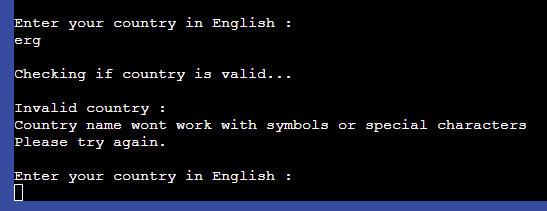
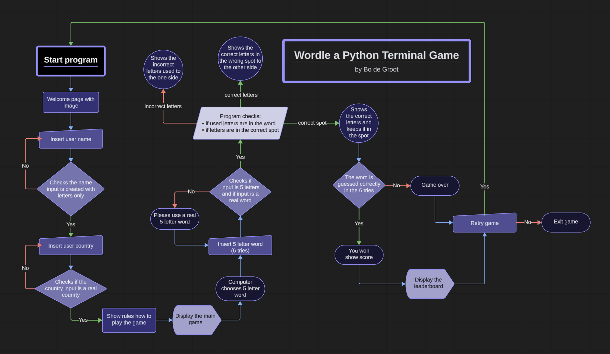
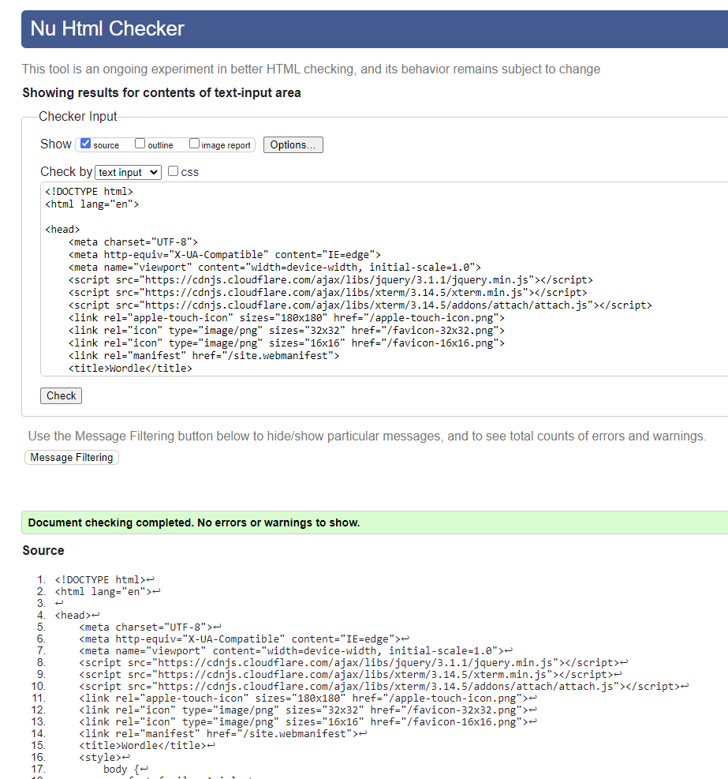
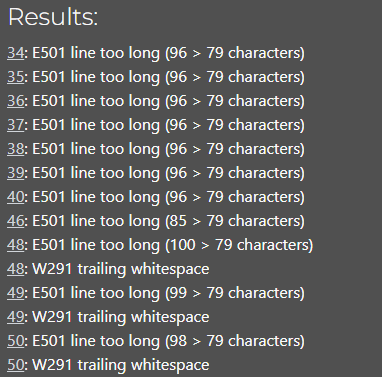
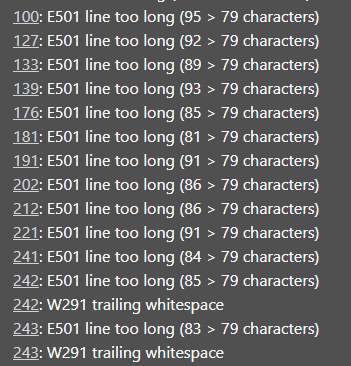

# Wordle

[Click on this link to visit the Github page](https://obiwanbonobi.github.io/PP3/)

[Click on this link to play the game on Heroku](https://wordle-bo-abd372c9b403.herokuapp.com/)

 

# Content

- [Introduction](#introduction)
    * [User experience](#user-experience)
    * [My vision for the game](#my-vision-for-the-game)
- [Features](#features)
- [Future features](#future-features)
- [Design](#design)
- [Technologies used](#technologies-used)
    * [Lucid Flowchart](#lucid-flowchart)
    * [Google Sheets](#google-sheets)
    * [Libraries](#libraries)
- [Testing](#testing)
    * [Python validation](#python-validation)
    * [HTML validation](#html-validation)
- [Bug fixes](#bug-fixes)
- [Deployment](#deployment)
    * [Github deployment](#github-deployment)
    * [Heroku deployment](#heroku-deployment)
- [Credits](#credits)

 

# Introduction

 I'm thrilled to present my very own Python-based Wordle game that promises to challenge and entertain you in equal measure. Dive into the realm of word-guessing, where you'll be tasked with unraveling a hidden five-letter word through strategic deduction and clever guessing. The users final "score" will be shown in the leaderboard option, if the user scores high enough.

## User experience

Wordle is a simple yet engaging word puzzle game that has gained popularity for its straightforward gameplay and addictive nature. That's why I decided to make my own version. The user experience for my Wordle game has been crafted to ensure both enjoyment and ease of play. The game is made for people who want to embark on a captivating journey of word discovery.

## My vision for the game

In envisioning the Wordle game, my goal was to cultivate an engaging and intellectually stimulating experience for players. I designed the game to strike a perfect balance between challenge and enjoyment. The core concept centers around guessing a hidden five-letter word within a limited number of attempts, fostering a sense of accomplishment when the correct word is uncovered. To enhance the game's appeal, I incorporated a diverse and dynamic word bank, keeping players on their toes with an ever-evolving linguistic challenge.

 

# Features

When the game starts, the user will be welcommed with the Wordle banner :

 

 

The user can then decide if they want to read the rules or not :

 

When y is pressed the rules will show.

 

After the rules have been read or skipped, you can type in your name and country you're from :

 

It will then validate the name input.

Then the country can be typed in.

It will then validate the name input.

It will then show a small welcome message with whatever name and country (in English) you chose.

 

The game then starts where you can start guessing the 5 letter word :

 

The word you guess has corresponding emojis underneath. Where if a letter is not in the word chosen by the computer, it will show a red cross underneath that letter. If a letter is in the word but in the incorrect spot, it will show a red circle. And finally if a letter is in the word and also in the correct spot, it will show a green check mark underneath.

 

Guessing the correct word, will show a small message congratulating the user :

 

 

When the incorrect word is guessed, it will show a small "You lost" message with the correct word :

 

 

The user is then asked if they want to see the leaderboard :

 

When y is pressed the leaderboard will show.

 

After the leaderboard is shown, the user is asked if they want to play again :

 

When y is pressed the game will start again, starting with the user input. When n is pressed the game will exit.

 

Error messages :

 

When anything other than alphabetical letters and or spaces are used, this error message will be shown.

When anything other than country names are used, this error message will pop up.

When anything other than a 5 letter real word is used, this message pops up.

When the user presseer anything other than y or n in these y/n questions, this message will be shown.

 

# Future features

- I want to change the code around so that the "guesses" get updated if you decide to play again. And it will copy the last name and country used. So the user would only have to fill out the name and country once.
- I want to change the emoji's to having the background of the letter in a different colour for better readability and flow.
- I want the add the alphabet. Were the letters background changes to either red or yellow, when the wrong letter or the letter was in the wrong spot gets guesssed.
- I want to add a feature where after finishing the game and seeing the leaderboard, you see the users score highlighted in the leaderboard. And if the the user scores outside the spectrum of the leaderboard, it will still show seperatly underneath.
- I would like to add a feature that tells the user if a word has already been used.

 

# Design

I wanted the colours to have an oldschool vibe to it, so it fits the vibe of a terminal game. I added some cute emojis that would fit with the style. And added a green line through all the "seperate" sections in the game

 

# Technologies used

- This project is written in Python
- [ChatGPT](https://chat.openai.com/) helped me with articulating myself better in the readme introduction.
- [Github](https://github.com/) was used to create a repository with the help of The Code Institute template.
- [Heroku](https://heroku.com/) was used to deploy my game.
- [Visual Studio Code](https://code.visualstudio.com/) is where I did all my coding.
- [HelpseoTools](https://helpseotools.com/text-tools/add-comma-online) helped me add a comma after every word in the countries file, for CSV to read the file properly.
- [TextFixer](https://www.textfixer.com/tools/remove-line-breaks.php) helped me get rid of the line breaks in my countries list, for CSV to read the file properly.
- [Favicon](https://favicon.io/) was used to create a unique favicon for the game.
- [Coolers](https://coolors.co/) was used to create a colour pallate.
- [Gif](https://ezgif.com/) was used to create a gif for my README.

## Lucid Flowchart

[LucidChart](https://www.lucidchart.com/pages/) was used to create a flow chart for planning my project.

 

 

## Google Sheets

[Google Sheets](https://www.google.com/sheets/about/) was used to create a leaderboard. After finishing the game, the leaderboard will be updated and the user has a choice to see if they want to see the leaderboard top 10 lowest guesses.

 

 

## Libraries

I got my libraries from different websites from the Code Institure project called Love Sandwiches :
- [<b>gspread</b>](https://docs.gspread.org/en/v5.10.0/) : The Code Institute helped me learn about that gspread is needed for connecting my Google Sheets to my python code.
- [<b>sys</b>](https://codedamn.com/news/python/exit-python-program-from-terminal) : I used the sys.exit() for when the user wants to exit the game.
- [<b>Rich</b>](https://rich.readthedocs.io/en/latest/introduction.html#installation) : I used the pannelling for the start page with Rich. Rich is also used to set the console width. And rprint() was used to print colourfull messages.
- [<b>Random</b>](https://www.geeksforgeeks.org/python-random-module/) : I used the Random import to randomize the word chosen by the computer.
- [<b>Credentials</b>](https://google-auth.readthedocs.io/en/master/reference/google.oauth2.service_account.html) : The Code Institute helped me learn about credentials and that I needed them for my Google Sheets, which is used for my leaderboard list.

 

# Testing

I did extensive testing to make sure my code has no bugs. Everything in my code works as it should.

## HTML validation

The HTML validator came back without any issues. I used [this website](https://validator.w3.org/) to test my code.

 

## Python validation

The first time I put my code through [The Code institutes Python linter](https://pep8ci.herokuapp.com/), the code came up with some minor isseus. After fixing these minor issues the code came back without issues.

 

\
\
\

 

# Bug fixes

- When I ran the game after adding a validation for the word input, it kept going to the error that I wasn't using a real word. I started trouble shooting and found that I was comparing the user input with my english list. However my english list was in lowercase and my input I wanted the word to be in uppercase. So I changes the words file so that it returned in uppercase.
- I noticed that using country names that contained a space weren't working. I ended up changing the file to a csv file so that fixed it.
- I noticed that some of the words in the words file were names and also words that noone will know. So I went through the list to delete them.
- The leaderboard wasn't updating properly. I had the code written that you enter you name and country once and then the guesses will update after you finish playing the game. However when you wanted to play again only the leaderboard guesses would update and the rows would become out of sync. I fixed it by changing the code around that you fill in your name and country every time.
- There was an issue with the score adding a point even if the wrong word was used. I had placed the score += 1 code in the wrong spot.
- When I deployed my repo for the first time it came up with this error :
    * ERROR: Could not find a version that satisfies the requirement pywin32==306 (from versions: none)
    * ERROR: No matching distribution found for pywin32==306 
I googled it online and [this forum](https://stackoverflow.com/questions/50026190/heroku-fails-to-install-pywin32-library) told me to just delete "pywin32==306" from my requirements file.
- My Favicon wasn't working because I forgot to set up the correct path to the file.

<b>I have not noticed any existing bugs.</b>

 

# Deployment

## Heroku deployment

To deploy Your App to Heroku, you have to :
- Create a Heroku account.
- From the dashboard select create new app.
- Enter a name for your app, it needs to be unique, and select your region then press create app.
- Select settings at the top of your app page.
- Press reveal config vars.
- If the user is using google sheets in their project, you'll have to name your credentials file in the key input and copy and paste that credential file in the value input.
- Also add PORT in key input and 8000 as value input.
- Scroll down and press the add buildpack button.
- From here press the Python icon and then the add buildpack button.
- Add another builpack and press the Nodejs icon this time and then press add buildpack button again.
- Scroll back up and select Deploy at the top of your app page.
- Choose your deployment method, when choosing Github, you will have to connect to your account.
- Then choose which repo you want to deploy and connect to it.
- Choose if you want to deploy automatic or manual, and press deploy.

## Github deployment

To fork this repository on Github, you have to :
  - Go to my [GitHub repository called PP3](https://github.com/ObiWanBonobi/PP3).
  - In the top-right corner of the page, click Fork.
  - Under "Owner," select the dropdown menu and click an owner for the forked repository.
  - By default, forks are named the same as their upstream repositories. Optionally, to further distinguish your fork, in the "Repository name" field, type a name.
  - Click Create fork.

To clone this repository, you have to :
  - Go to my [GitHub repository called PP3](https://github.com/ObiWanBonobi/PP3).
  - Above the list of files, click  Code.
  - Copy the URL for the repository.
  - Open Git Bash.
  - Change the current working directory to the location where you want the cloned directory.
  - Type git clone, and then paste the URL you copied earlier.
  - Press Enter to create your local clone.

You can see deployed game [here](https://wordle-bo-abd372c9b403.herokuapp.com/).

 

# Credits

- <b>FlowChart</b> : I got some ideas for my flowchart from [Pedro Cristo's PP3](https://github.com/PedroCristo/portfolio_project_3).
- <b>Emoji</b> : I got my emojis from [Emojipedia](https://emojipedia.org/).
- <b>English words</b> : I got the english 5 letter words from [The free dictionary](https://www.thefreedictionary.com/5-letter-words.htm).
- <b>All words</b> : I got my list of all english words from [Charles Reid's Github](https://github.com/charlesreid1/five-letter-words/blob/master/sgb-words.txt)
- <b>Countries list</b> : I got the list of all countries from [World o meters](https://www.worldometers.info/geography/alphabetical-list-of-countries/).
- <b>README</b> : I copied some of the Readme code from my previous projects [PP1](https://github.com/ObiWanBonobi/PP1/blob/main/README.md) and [PP2](https://github.com/ObiWanBonobi/PP2/tree/main). I also got some ideas from [Gary Dolan's readme](https://github.com/GaryDolan/ci-p3-pokemon-portfolio).
- <b>Python code</b> : I got a better understanding about Python code from these forums, websites and people :
  * I learned more about enumerate from the [Geeks for Geeks](https://www.geeksforgeeks.org/enumerate-in-python/) website.
  * I got help with a better understanding of Python from my brother in law [Steffen Bjerkenås](https://github.com/stebje). He told me I needed to change my words list and country list to a text and CSV files and move them into a seperate file for better readability.
  * [GeeksforGeeks.org](https://www.geeksforgeeks.org/pulling-a-random-word-or-string-from-a-line-in-a-text-file-in-python/) helped me with understanding how to get a random word from a text file.
  * I got my get_leaderboard function from [Pedro Cristo's](https://github.com/PedroCristo/portfolio_project_3/blob/main/run.py) project the hangmans game. I would've figured the code out myself, however I was running out of time and needed to finish the project on time.
  * I learned a lot from the Code Institutes project [Love Sandwiches](https://github.com/Code-Institute-Solutions/love-sandwiches-p5-sourcecode).

- <b>Most of my credit goes to the Code Institute program where I made notes on every section and got most of my ideas and code from there.</b>
